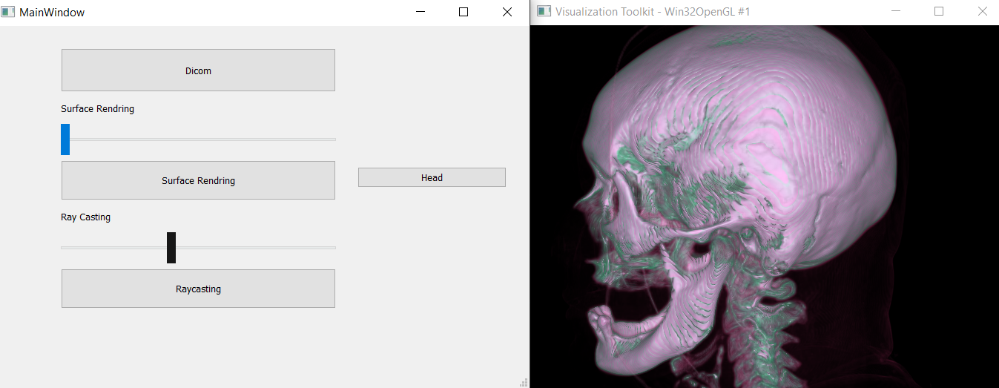

# Medical Visualization

## Steps:

First Browse to choose a folder containing files with extension dcm , the folder's name will appear in the browse button.

Second choose one of the buttons to open its window either volume rendering or raycasting.

Third change the slider for volume rendering to change volume, and the slider for raycasting to change the color. 

## Results sample
### Volume Rendering

### RayCasting

